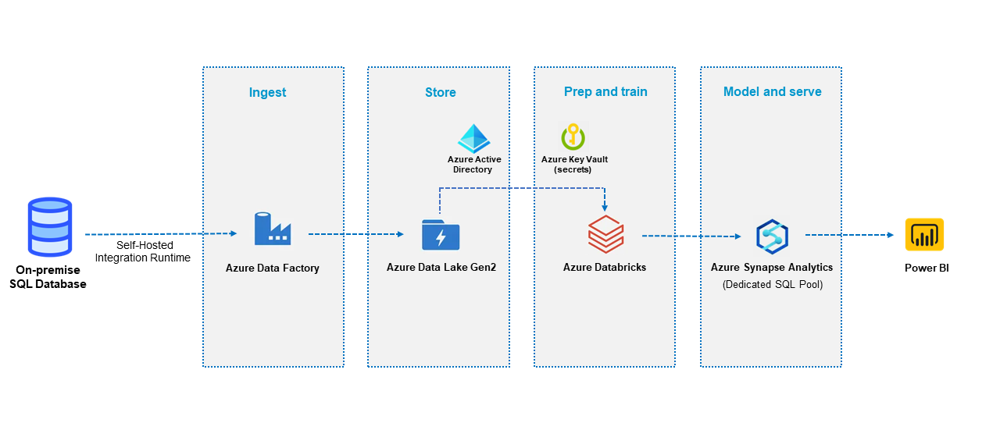

# Olist-Store-Ecommerce-Data-Engineering-Project

---
 
**Data Engineering Project** is an implementation of the data pipeline which consumes the latest news from RSS Feeds and makes them available for users via handy API.
The pipeline infrastructure is built using popular, open-source projects.

**Use Case** : E-Commerce Revenue Forecasting

**Objective** :  
The goal of the project is to predict e-commerce revenue based on historical transaction data from the on-premises Olist store dataset. By processing and analyzing this extensive historical transaction data, the pipeline aims to provide insights into revenue trends and patterns, enabling the e-commerce business to make data-driven decisions for strategic planning and optimization.
 
 
**Dataset** : https://www.kaggle.com/datasets/olistbr/brazilian-ecommerce
 
 
</img>
 
 
</img>
</img>
</img>
</img>
</img>
</img>

---

## Architecture diagram

---

## How it works

#### Data Ingestion
- The skillfully architected and executed comprehensive data pipeline in Azure, adeptly designed to facilitate precise e-commerce revenue prediction from extensive historical transaction data,
- seamlessly ingests vast amounts of information from the on-premises Olist store dataset and SQL Server into Azure Data Lake Storage using the formidable Azure Data Factory.

#### Data Transformation 
- Leveraging the immense capabilities of Azure Databricks, the pipeline conducts advanced data processing and intricate feature engineering, elevating data quality to unparalleled heights for impeccable predictive accuracy.

#### Data Warehousing:
- The discerningly curated analytical data finds its rightful place in Azure Synapse, where it is stored as a data warehouse, enabling efficient and scalable storage for further analysis and reporting.

#### Dashboarding:
- The magic of Power BI brings the data to life through captivating and enlightening revenue prediction dashboards, empowering the e-commerce business with invaluable data-driven insights for astute and informed strategic decision-making. 
- These interactive dashboards provide a visual representation of the predicted revenue trends, enabling stakeholders to monitor performance and identify growth opportunities easily.

#### Data Governance and Security: 
- Throughout the data pipeline, data governance and security measures are essential to ensure data quality, privacy, and compliance with regulations. This involves data access control, encryption, auditing, and data lineage tracking.

---
